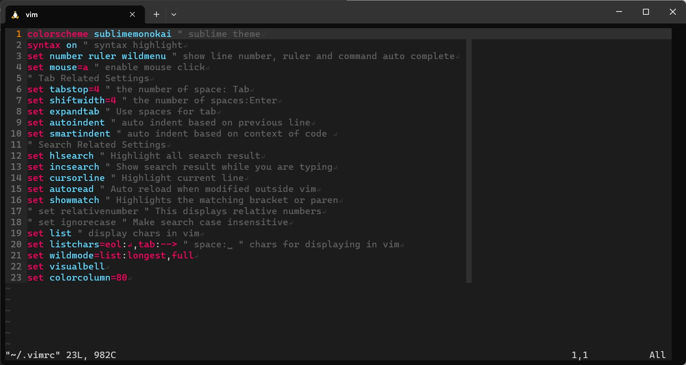

# dotvimrc

## This is the personal vimrc file for my vim setup.

## Installation
/bin/sh ./install.sh

## Features
1. sublime theme
2. auto complete + indent + reload
3. highlight matching bracket + search result + current line
4. display line number + ruler + 80-word column

## Optional
1. display chars in vim + relative numbers
2. make search case insensitive
3. display space:␣ and eol:↵

## Screenshot
